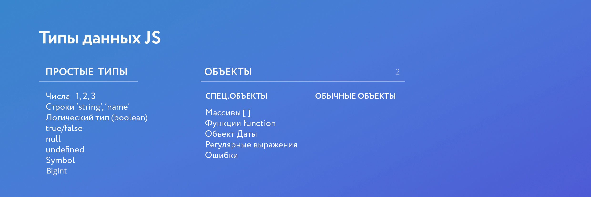
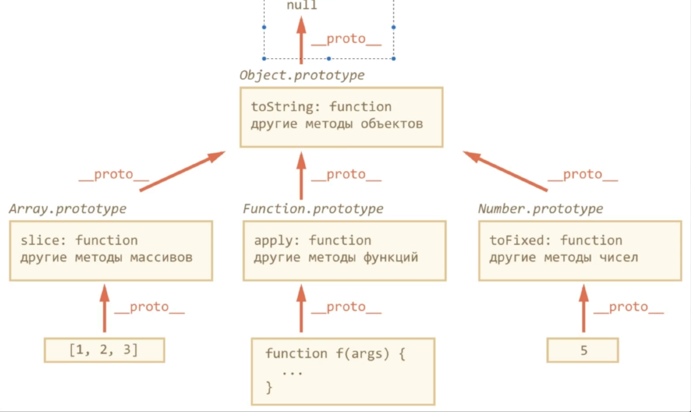

# 
 JavaScript_udemy 

***
## Первая часть курса. Основы работы с JS

### Урок #4 Что такое JS и как его подключить к странице
[JavaScript: The Definitive Guide: Master the World's Most-Used Programming Language](https://www.amazon.com/JavaScript-Definitive-Guide-David-Flanagan/dp/1491952024/ref=sr_1_1?dchild=1&keywords=JavaScript%3A+The+Definitive+Guide&qid=1586077372&sr=8-1 'JavaScript: The Definitive Guide')

### Урок #5 Переменные и строгий режим
[Strict-mode](https://developer.mozilla.org/ru/docs/Web/JavaScript/Reference/Strict_mode)

Сервис для проверки совместимости элементов с браузерами: [Caniuse.com](https://caniuse.com/)

### Урок #6  Классификация типов данных в JavaScript
Новый тип данных в JS - <a href='https://medium.com/@hydrock/bigint-%D0%BD%D0%BE%D0%B2%D1%8B%D0%B9-%D1%82%D0%B8%D0%BF-%D0%B4%D0%B0%D0%BD%D0%BD%D1%8B%D1%85-%D0%B2-js-dd5c29446570' target="_blank">BigInt</a>

Тип данных [Symbol](https://learn.javascript.ru/symbol)

### Урок #7 Простое общение с пользователем

Оператор  [typeof](https://developer.mozilla.org/ru/docs/Web/JavaScript/Reference/Operators/typeof) возвращает строку, указывающую тип операнда.

[Document.write()](https://developer.mozilla.org/ru/docs/Web/API/Document/write)

### Урок #8 Интерполяция (ES6)
[Шаблонными литералами](https://developer.mozilla.org/ru/docs/Web/JavaScript/Reference/template_strings) (\` \`) называются строковые литералы, допускающие использование выражений внутри.

### Урок #9 Операторы в JS
[Приоритет операторов](https://developer.mozilla.org/ru/docs/Web/JavaScript/Reference/Operators/Operator_Precedence#Table 'Таблица приоритетов') определяет порядок, в котором операторы выполняются. Операторы с более высоким приоритетом выполняются первыми.

### Урок #10 Учимся работать с системой контроля версий Git и с сервисом GitHub
[Git How To](https://githowto.com/ru) — знакомство с основами Git.

Более подробное [руководство](https://git-scm.com/book/ru/v2/%D0%92%D0%B2%D0%B5%D0%B4%D0%B5%D0%BD%D0%B8%D0%B5-%D0%9E-%D1%81%D0%B8%D1%81%D1%82%D0%B5%D0%BC%D0%B5-%D0%BA%D0%BE%D0%BD%D1%82%D1%80%D0%BE%D0%BB%D1%8F-%D0%B2%D0%B5%D1%80%D1%81%D0%B8%D0%B9) по работе с Git.

Установка системы контроля версий [git-scm.com](https://git-scm.com/).

### Урок #11 Как работать с GitHub с разных компьютеров, gitignore и Git Kraken
Git GUI - [GitKraken](https://www.gitkraken.com/)

Настроенный [gitignore](https://drive.google.com/open?id=1XjU5Bv9B795eQa2c0rfg_Hr11sFvWwgh) от преподавателя курса.

### Урок #12 Практика, ч.1. Начинаем создавать приложение
[Практика 1. Основы работы с массивами и объектами.](https://github.com/yankovalenko94/JS_task_answers/tree/master/JS_step_1)

### Урок #13 Условия
[Условные конструкции](https://developer.mozilla.org/ru/docs/Learn/JavaScript/Building_blocks/conditionals)

### Урок #14 Циклы
[Циклы и итерации](https://developer.mozilla.org/ru/docs/Web/JavaScript/Guide/%D0%A6%D0%B8%D0%BA%D0%BB%D1%8B_%D0%B8_%D0%B8%D1%82%D0%B5%D1%80%D0%B0%D1%86%D0%B8%D0%B8
)

### Урок #15 Практика, ч2. Применяем условия и циклы
[Практика 2. Применение циклов и условий](https://github.com/yankovalenko94/JS_task_answers/tree/master/JS_step_2)

### Урок #16 Функции, стрелочные ф-ции (ES6)

[Замыкания](https://medium.com/nuances-of-programming/%D1%8F-%D0%BD%D0%B8%D0%BA%D0%BE%D0%B3%D0%B4%D0%B0-%D0%BD%D0%B5-%D0%BF%D0%BE%D0%BD%D0%B8%D0%BC%D0%B0%D0%BB-%D0%B7%D0%B0%D0%BC%D1%8B%D0%BA%D0%B0%D0%BD%D0%B8%D1%8F-%D0%B2-javascript-%D1%87%D0%B0%D1%81%D1%82%D1%8C-%D0%BF%D0%B5%D1%80%D0%B2%D0%B0%D1%8F-3c3f02041970) в JavaScript

### Урок #17 Методы и свойства строк и чисел

Строковый тип данных [String](https://learn.javascript.ru/string)

### Урок #18 Практика , ч3. Используем функции

[Практика 3. Применение функций](https://github.com/yankovalenko94/JS_task_answers/tree/master/JS_step_3)

### Урок #19 Callback - функции

[Callback](https://learn.javascript.ru/callbacks) функции

### Урок #20 Объекты, деструктуризация объектов (ES6)
[Деструктурирующее присваивание](https://learn.javascript.ru/destructuring#destrukturizatsiya-obekta) – это специальный синтаксис, который позволяет нам «распаковать» массивы или объекты в кучу переменных, так как иногда они более удобны.

[Объекты ](https://javascript.ru/tutorial/object/intro) Javascript в примерах

Перебор свойств объкта с помощью [for-in](https://learn.javascript.ru/object-for-in)

### Урок #21 Массивы и псевдомассивы

Алгоритм [быстрой сортировки](http://algolist.ru/sort/quick_sort.php)

[Отличие](http://coldfox.ru/article/5c7ffe64bbf20e61c12c7348/%D0%9E%D1%82%D0%BB%D0%B8%D1%87%D0%B8%D0%B5-for-of-%D0%BE%D1%82-for-in-%D0%B2-javascript) for...of от for...in в javascript

### Урок #22 Передача по ссылке или по значению, Spread оператор (ES6-ES9)

[Копирование](https://medium.com/@stasonmars/%D0%BA%D0%BE%D0%BF%D0%B8%D1%80%D0%BE%D0%B2%D0%B0%D0%BD%D0%B8%D0%B5-%D0%BE%D0%B1%D1%8A%D0%B5%D0%BA%D1%82%D0%BE%D0%B2-%D0%B2-javascript-d25c261a7aff
) объектов в JavaScript

### Урок #23 Основы ООП, прототипно-ориентированное наследование
Метод [Object.assign()](https://developer.mozilla.org/ru/docs/Web/JavaScript/Reference/Global_Objects/Object/assign) используется для копирования значений всех собственных перечисляемых свойств из одного или более исходных объектов в целевой объект.

[Spread-operator](https://developer.mozilla.org/ru/docs/Web/JavaScript/Reference/Operators/Spread_syntax)

[Прототипы](https://developer.mozilla.org/ru/docs/Web/JavaScript/Reference/Global_Objects/Object/proto) в javascript

### Урок #24 Практика , ч4. Используем объекты
[Практика 4. Рефакторинг кода](https://github.com/yankovalenko94/JS_task_answers/tree/master/JS_step_4)

### Урок #26 Динамическая типизация в JS

[cssText](https://www.w3schools.com/jsref/prop_style_csstext.asp)

### Урок #31 События и их обработчики
Список родных [событий](https://oddler.ru/blog/i63) Javascript

Метод [EventTarget.addEventListener()](https://developer.mozilla.org/ru/docs/Web/API/EventTarget/addEventListener)

Метод [EventTarget.removeEventListener()](https://developer.mozilla.org/ru/docs/Web/API/EventTarget/removeEventListener)

### Урок #32 Навигация по DOM - элементам, data-атрибуты, преимущество for_of
Использование [data-* атрибутов](https://developer.mozilla.org/ru/docs/Web/Guide/HTML/Using_data_attributes)

### Урок #33 Практика. Используем события на странице проекта
[Практика. Финальное задание по первой главе](https://github.com/yankovalenko94/JS_task_answers/tree/master/JS_step_6)

### Урок #34 События на мобильных устройствах

Cпособы осуществления обработки [тач-событий разной сложности](http://youon.ru/%D0%90%D0%BD%D0%B4%D1%80%D0%BE%D0%B8%D0%B4/%D0%A0%D0%B0%D0%B7%D1%80%D0%B0%D0%B1%D0%BE%D1%82%D0%BA%D0%B0/touch-sobytiya-na-javascript-multitach-realizatsiya) на Javascript Event'ах, без сторонних библиотек

---

037 classList
https://developer.mozilla.org/ru/docs/Web/API/Element/classList

037 matches
https://developer.mozilla.org/ru/docs/Web/API/Element/matches

037 -1
https://learn.javascript.ru/event-delegation

037 -2
https://medium.com/@stasonmars/%D0%B4%D0%B5%D0%BB%D0%B5%D0%B3%D0%B8%D1%80%D0%BE%D0%B2%D0%B0%D0%BD%D0%B8%D0%B5-%D1%81%D0%BE%D0%B1%D1%8B%D1%82%D0%B8%D0%B8%CC%86-%D0%B2-javascript-d91cbdd8916a

038 -
https://drive.google.com/open?id=1-IIzpirT_ydJ-A6gij0_f7oz6MK7YdRS

039 JavaScript-
https://learn.javascript.ru/js-animation

039 -
https://drive.google.com/open?id=1U-AISCK350rGCCXZ7faYnolh8aF0jX8a

040 -Date
https://developer.mozilla.org/ru/docs/Web/JavaScript/Reference/Global_Objects/Date

040 -
https://learn.javascript.ru/date

041 - Создание таймера обратного отсчета в проекте
https://alligator.io/js/object-property-shorthand-es6/

042 -
https://drive.google.com/open?id=1eTxWzmaDfN0CXHC7Dv_AE39A1GlNO1nI

043 -
https://keycode.info/

044 -
https://github.com/yankovalenko94/JS_task_answers/tree/master/JS_step_10

045 -
https://learn.javascript.ru/constructor-new

046 -this
https://tproger.ru/translations/javascript-this-keyword/

047 -
https://developer.mozilla.org/ru/docs/Web/JavaScript/Reference/Classes

048 -
https://github.com/yankovalenko94/JS_task_answers/tree/master/JS_step_11

049 rest
https://developer.mozilla.org/ru/docs/Web/JavaScript/Reference/Functions/Rest_parameters

049 -
https://developer.mozilla.org/ru/docs/Web/JavaScript/Reference/Functions/Default_parameters

050 MAMP
https://www.mamp.info/ru/

050 OpenServer
https://ospanel.io/

051 -
https://medium.com/@stasonmars/%D0%BA%D0%BE%D0%BF%D0%B8%D1%80%D0%BE%D0%B2%D0%B0%D0%BD%D0%B8%D0%B5-%D0%BE%D0%B1%D1%8A%D0%B5%D0%BA%D1%82%D0%BE%D0%B2-%D0%B2-javascript-d25c261a7aff

051 Http
https://ru.wikipedia.org/wiki/HTTP

051 JSON
https://ru.wikipedia.org/wiki/JSON

052 XMLHttpRequest
https://developer.mozilla.org/ru/docs/Web/API/XMLHttpRequest

052 -XMLHttpRequest
https://developer.mozilla.org/ru/docs/Web/API/XMLHttpRequest/Using_XMLHttpRequest

052 -FormData
https://developer.mozilla.org/ru/docs/Web/API/FormData/Using_FormData_Objects

052 -formData-JSON
https://ilikekillnerds.com/2017/09/convert-formdata-json-object/

052 -HTTP
https://ru.wikipedia.org/wiki/%D0%97%D0%B0%D0%B3%D0%BE%D0%BB%D0%BE%D0%B2%D0%BA%D0%B8_HTTP

052 XMLHttpRequest.readyState
https://developer.mozilla.org/ru/docs/Web/API/XMLHttpRequest/readyState

052 -
https://drive.google.com/open?id=11i7oxwYpQ2K6roXprxQwVvRSnzWjGlWM

053 -
https://github.com/yankovalenko94/JS_task_answers/tree/master/JS_step_13

054 -
https://github.com/yankovalenko94/JS_task_answers/tree/master/JS_step_14

055 Promise-1
https://learn.javascript.ru/promise-basics

055 Promise-2
https://developer.mozilla.org/ru/docs/Web/JavaScript/Reference/Global_Objects/Promise

056 Fetch-API
https://developer.mozilla.org/ru/docs/Web/API/Fetch_API/Using_Fetch

056 -
https://github.com/yankovalenko94/JS_task_answers/tree/master/JS_step_15

057 map
https://developer.mozilla.org/ru/docs/Web/JavaScript/Reference/Global_Objects/Array/map

057 filter
https://developer.mozilla.org/ru/docs/Web/JavaScript/Reference/Global_Objects/Array/filter

057 reduce
https://developer.mozilla.org/ru/docs/Web/JavaScript/Reference/Global_Objects/Array/Reduce

057 Object.entries-
https://developer.mozilla.org/ru/docs/Web/JavaScript/Reference/Global_Objects/Object/entries

058 Json-server
https://github.com/typicode/json-server

058 -
https://drive.google.com/open?id=1ywUhwbSURxYa4CUtOs8mtbos0DP5OXD4

059 -
https://github.com/yankovalenko94/JS_task_answers/tree/master/JS_step_16

059 -JavaScript
https://www.youtube.com/watch?v=wPG7RgPzxmM

060 Axios
https://github.com/axios/axios

060 cdnjs
https://cdnjs.com/

060 -
https://www.youtube.com/watch?v=5w5hmUgrTFo

061 -
https://github.com/yankovalenko94/JS_task_answers/tree/master/JS_step_17

062 string.slice-
https://developer.mozilla.org/ru/docs/Web/JavaScript/Reference/Global_Objects/String/slice

062 -
https://github.com/yankovalenko94/JS_task_answers/tree/master/JS_step_18

063 -
https://drive.google.com/open?id=1h6FiFT-O1teeS9VJGKenB_dp9r9jgihM

064 -
http://dev-test.nemikor.com/web-storage/support-test/

064 LocalStorage-
https://tproger.ru/articles/localstorage/

065 -
https://regex101.com/

065 -RegExp
https://developer.mozilla.org/ru/docs/Web/JavaScript/Reference/Global_Objects/RegExp

066 -
https://fitseven.ru/zdorovie/metabolism/sutochnaya-norma-kaloriy

067 -
https://github.com/yankovalenko94/JS_task_answers/tree/master/JS_step_22

068 -get-set
https://learn.javascript.ru/property-accessors

069 -
http://www.codenet.ru/progr/cpp/ipn.php

069 -JavaScript
https://medium.com/devschacht/javascripts-new-private-class-fields-c60daffe361b

070 -
https://habr.com/ru/company/ruvds/blog/419997/

071 -CommonJS
http://largescalejs.ru/commonjs-modules/

071 -Webpack
https://webpack.js.org/guides/getting-started/

071 -
https://webpack.js.org/

071 -devtool
https://webpack.js.org/configuration/devtool/

072 ES6-Modules
https://frontender.info/es6-modules/

073 -JS
https://www.udemy.com/course/javascript_practice/?referralCode=9DD7B19DD5505880B724

073 -
https://github.com/yankovalenko94/JS_task_answers/tree/master/JS_step_24

074 -JS
https://www.udemy.com/course/javascript_practice/?referralCode=9DD7B19DD5505880B724

075 try-catch
https://developer.mozilla.org/ru/docs/Web/JavaScript/Reference/Statements/try...catch

076 Babel
https://babeljs.io/

076 -
https://browserl.ist/

076 Core.js
https://github.com/zloirock/core-js

076 es6-promise
https://www.npmjs.com/package/es6-promise

076 foreach-polyfill
https://www.npmjs.com/package/nodelist-foreach-polyfill

076 -webpack
https://drive.google.com/open?id=1av3MQV-KVV3ovSV4rZY_T4R5JXbGzLrO

077 angular
https://angular.io/

077 React
https://ru.reactjs.org/

077 Vue
https://vuejs.org/

078 -
http://jquery.page2page.ru/index.php5/%D0%97%D0%B0%D0%B3%D0%BB%D0%B0%D0%B2%D0%BD%D0%B0%D1%8F_%D1%81%D1%82%D1%80%D0%B0%D0%BD%D0%B8%D1%86%D0%B0

078 cdnjs
https://cdnjs.com/

079 -
https://developer.mozilla.org/ru/docs/Web/JavaScript/Reference/Statements/function*

080 -
https://learn.javascript.ru/js-animation#funktsii-raschyota-vremeni

080 CSS3-
https://html5book.ru/css3-animation/

081 -
http://latentflip.com/loupe/?code=JC5vbignYnV0dG9uJywgJ2NsaWNrJywgZnVuY3Rpb24gb25DbGljaygpIHsKICAgIHNldFRpbWVvdXQoZnVuY3Rpb24gdGltZXIoKSB7CiAgICAgICAgY29uc29sZS5sb2coJ1lvdSBjbGlja2VkIHRoZSBidXR0b24hJyk7ICAgIAogICAgfSwgMjAwMCk7Cn0pOwoKY29uc29sZS5sb2coIkhpISIpOwoKc2V0VGltZW91dChmdW5jdGlvbiB0aW1lb3V0KCkgewogICAgY29uc29sZS5sb2coIkNsaWNrIHRoZSBidXR0b24hIik7Cn0sIDUwMDApOwoKY29uc29sZS5sb2coIldlbGNvbWUgdG8gbG91cGUuIik7!!!PGJ1dHRvbj5DbGljayBtZSE8L2J1dHRvbj4%3D

082 -JS
https://www.udemy.com/course/javascript_practice/?referralCode=9DD7B19DD5505880B724

082 tiny-slider
https://github.com/ganlanyuan/tiny-slider

082 OwlCarousel
https://owlcarousel2.github.io/OwlCarousel2/

082 Slick-slider
https://kenwheeler.github.io/slick/

082 galleria.js
https://galleriajs.github.io/

082 fotorama
https://fotorama.io/

082 hammerjs
https://hammerjs.github.io/

082 -
https://nisnom.com/

082 8-JavaScript-2020-
https://www.youtube.com/watch?v=tuhEduhHCGw&t=1s
